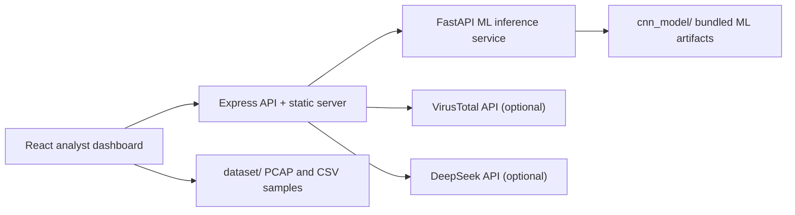

# 🛡️ AI-Based Mobile Network Intrusion Detection


AI-Based Mobile Network Intrusion Detection is a local **5G intrusion detection system (5G IDS) research dashboard** for analyzing mobile-network-style traffic, PCAP-derived flow records, and suspicious indicators. The project combines a web-based analyst interface, backend enrichment APIs, a FastAPI machine-learning inference service, sample datasets, and bundled model artifacts so researchers can run, inspect, and extend the system without training a model first.

The system is designed as a **detection and analysis platform**, not an inline prevention device. It helps analysts classify traffic as clean, suspicious, or malicious, review evidence, inspect PCAP-derived features, and generate exportable investigation material.

## 🎯 Academic Aim

The purpose of this project is to demonstrate how machine learning can support intrusion detection in modern mobile-network environments, especially where traffic analysis must combine statistical behavior, protocol hints, and analyst-readable evidence.

The project focuses on these research questions:

- How can network-flow features be transformed into useful inputs for intrusion detection models?
- Can a hybrid model pipeline improve detection coverage compared with a single classifier?
- How can an IDS dashboard make model results understandable to a security analyst?
- How can optional threat intelligence and AI explanation tools support triage without exposing API keys in the browser?

## 📚 Project Context

Mobile and 5G networks introduce complex traffic patterns across user-plane and control-plane paths. Traditional rule-only inspection is often too rigid for dynamic environments, while pure machine-learning output can be difficult for analysts to trust without supporting context.

This project addresses that gap by combining:

- **Flow-based intrusion detection** using engineered traffic features.
- **Hybrid ML scoring** using supervised and unsupervised approaches.
- **PCAP ingestion** for repeatable lab experiments.
- **Threat-intelligence enrichment** using VirusTotal when a key is provided.
- **Explainable analyst workflow** through dashboard evidence, export tools, and an optional AI assistant.

## ✨ Highlights

- 🧠 **Bundled AI model**: Random Forest, Isolation Forest, and AutoEncoder artifacts are included in `cnn_model/`.
- 📡 **5G/mobile traffic workflow**: PCAP ingestion, flow parsing, traffic-plane hints, bearer/session fields, and analyst triage views.
- 🔎 **Threat enrichment**: optional VirusTotal IP/domain reputation checks.
- 💬 **AI assistant**: optional DeepSeek-powered dashboard assistant for explaining selected flows and export summaries.
- 📊 **Analyst dashboard**: live-style traffic table, analytics view, ML lab, export tools, and report-ready evidence.
- 🧪 **Sample data included**: datasets and PCAP samples are provided under `dataset/`.
- 🔐 **Secret-safe design**: API keys stay in `backend/.env` and are never committed or injected into the frontend bundle.

## 📸 Screenshots

| Dashboard | ML Lab |
|---|---|
|  |  |

## 🧩 System Architecture



### Main Components

| Layer | Technology | Role |
|---|---|---|
| Frontend | React, TypeScript, Vite | Dashboard, traffic table, analytics, ML lab, assistant UI |
| Web API | Node.js, Express | Serves the app, proxies enrichment APIs, keeps secrets server-side |
| ML service | Python, FastAPI | Loads trained artifacts and returns classification/inference results |
| Models | scikit-learn, Keras/TensorFlow | Random Forest, Isolation Forest, AutoEncoder |
| Data | CSV and PCAP samples | Repeatable training, demo, and analysis inputs |

## 🧠 Methodology

The project follows a flow-based IDS methodology:

1. **Traffic acquisition**: PCAP files or sample CSV datasets are used as traffic sources.
2. **Flow extraction**: packets are transformed into structured flow records.
3. **Feature engineering**: numeric and protocol-oriented features are generated.
4. **Model inference**: the backend sends feature vectors to the ML service.
5. **Hybrid scoring**: supervised and anomaly-based outputs are combined for triage.
6. **Analyst review**: the dashboard presents status, confidence, evidence, and enrichment.

### Feature Set

The bundled model uses the following feature fields:

| Feature | Meaning |
|---|---|
| `log_duration` | Log-transformed flow duration |
| `log_bytes` | Log-transformed byte count |
| `log_packets` | Log-transformed packet count |
| `avg_pkt` | Average packet size |
| `sport_n` / `dport_n` | Normalized source and destination ports |
| `is_tcp`, `is_udp`, `is_sctp` | Transport protocol indicators |
| `is_gtpu` | GTP-U/mobile user-plane indicator |
| `is_ssh`, `is_dns` | Common service indicators |
| `log_bytes_per_sec` | Log-transformed throughput |
| `log_pkts_per_sec` | Log-transformed packet rate |

## 🤖 Machine-Learning Design

The model bundle uses a hybrid IDS approach:

- **Random Forest**: supervised classification for known clean, suspicious, and malicious patterns.
- **Isolation Forest**: unsupervised anomaly detection for unusual flow behavior.
- **AutoEncoder**: reconstruction-error based anomaly scoring, trained primarily on clean traffic.

This hybrid design is useful in an academic IDS setting because it allows both **known-pattern classification** and **behavioral anomaly detection**. The dashboard exposes model outputs in analyst-readable form instead of treating the model as a black box.

## 📈 Evaluation Summary

The included `cnn_model/meta.json` reports evaluation results for the bundled model:

| Metric | Value |
|---|---:|
| Total rows | 60,000 |
| Training rows | 46,800 |
| Holdout test rows | 13,200 |
| Holdout accuracy | 0.9804 |
| Holdout macro F1 | 0.9804 |
| Holdout weighted F1 | 0.9804 |
| Macro average FPR | 0.0098 |
| Random Forest CV accuracy | 0.9807 ± 0.0012 |
| Random Forest mean prediction latency | 0.00237 ms/row |
| AutoEncoder mean prediction latency | 0.014918 ms/row |

### Per-Class Holdout Results

| Class | Precision | Recall | F1 | Support | One-vs-rest FPR |
|---|---:|---:|---:|---:|---:|
| Clean / Benign | 0.9646 | 0.9770 | 0.9708 | 4,400 | 0.0180 |
| Suspicious | 0.9995 | 1.0000 | 0.9998 | 4,400 | 0.0002 |
| Malicious | 0.9772 | 0.9641 | 0.9706 | 4,400 | 0.0112 |

These metrics are from a controlled lab evaluation and should be interpreted as research results, not production guarantees. Real-world deployment would require broader traffic diversity, live validation, adversarial testing, and continuous retraining.

## 🧪 Dataset and Artifacts

The repository includes sample and training artifacts for reproducibility:

| Path | Purpose |
|---|---|
| `dataset/imported/` | Larger imported flow dataset used by the current model metadata |
| `dataset/pcap/` | Demo PCAP files for dashboard analysis |
| `dataset/trained/` | Training/demo CSV and PCAP examples |
| `dataset/not_trained/` | Additional test samples not used as the main trained dataset |
| `cnn_model/` | Current trained model bundle and evaluation artifacts |
| `cnn_model/metrics_dashboard.html` | Model evaluation dashboard |
| `cnn_model/rf_confusion_matrix.png` | Random Forest confusion matrix |
| `cnn_model/ae_training_loss.png` | AutoEncoder training loss plot |

## 🚀 Quick Start on Windows

1. Install **Node.js LTS** from <https://nodejs.org/>.
2. Install **Python 3.10+** from <https://www.python.org/> and enable **Add Python to PATH**.
3. Double-click `START.bat`.
4. When asked for keys:
   - Paste a DeepSeek API key to enable the AI assistant, or press Enter to skip.
   - Paste a VirusTotal API key to enable live reputation lookups, or press Enter to skip.
5. Open <http://127.0.0.1:5003> if the browser does not open automatically.

The dashboard still works if both optional keys are skipped.

## 🧰 Manual Run

```powershell
npm install
python -m venv .venv
.\.venv\Scripts\python.exe -m pip install -r backend\requirements.txt
npm run build
$env:PYTHON="$PWD\.venv\Scripts\python.exe"
node launch.mjs
```

## 🔐 Environment

Secrets belong in `backend/.env`, which is ignored by Git.

```env
DEEPSEEK_API_KEY=
VIRUSTOTAL_API_KEY=
VIRUSTOTAL_MIN_INTERVAL_MS=15000
MNIDS_PORT=5003
ML_SERVER_PORT=8787
ML_SERVER_URL=http://127.0.0.1:8787
NODE_ENV=production
DEBUG=false
```

Use `backend/.env.example` as the template. `START.bat` creates it automatically if missing.

## 🔎 Analyst Workflow

The dashboard supports a repeatable analyst flow:

1. Select or upload a PCAP file.
2. Parse traffic into flow records.
3. Score flows with the current RF/IF/AE model bundle.
4. Review clean, suspicious, and malicious classifications.
5. Enrich public IPs/domains with VirusTotal if configured.
6. Pin interesting flows and ask the optional AI assistant for concise explanations.
7. Export results for reporting or further analysis.

## 📂 Useful Paths

| Path | Purpose |
|---|---|
| `frontend/` | React dashboard source |
| `backend/server.js` | Express web/API server |
| `backend/inference_server.py` | FastAPI ML inference service |
| `cnn_model/` | Bundled trained model artifacts |
| `dataset/` | Training/demo CSV and PCAP samples |
| `docs/PROJECT_GUIDE.md` | Maintainer and repo guidance |
| `HOW_TO_RUN.md` | Beginner-friendly run guide |

## 🧪 Validation

```powershell
npm run build
.\.venv\Scripts\python.exe -m pytest
```

If no tests are present, at minimum run `npm run build` and start the app with `node launch.mjs` or `START.bat`.

## ⚠️ Scope and Limitations

This is a local detection and analyst-support tool. It classifies and explains traffic; it does not block packets, change network policy, or act as an inline firewall.

Important limitations:

- Lab results may not generalize to every production mobile-network environment.
- Model quality depends on dataset coverage and feature quality.
- VirusTotal and DeepSeek features require user-provided API keys.
- The system is intended for research, education, experimentation, and dashboard prototyping.

## 🔭 Future Work

Potential academic and engineering extensions include:

- Add more public benchmark datasets and compare model performance.
- Add explainability methods such as feature importance per flow.
- Add richer 5G protocol parsing for control-plane and user-plane scenarios.
- Add automated report generation with methodology and evidence appendices.
- Add continuous retraining workflows and drift monitoring.
- Add Docker-based deployment for easier reproducibility.

## 📄 License

MIT License. See `LICENSE`.
