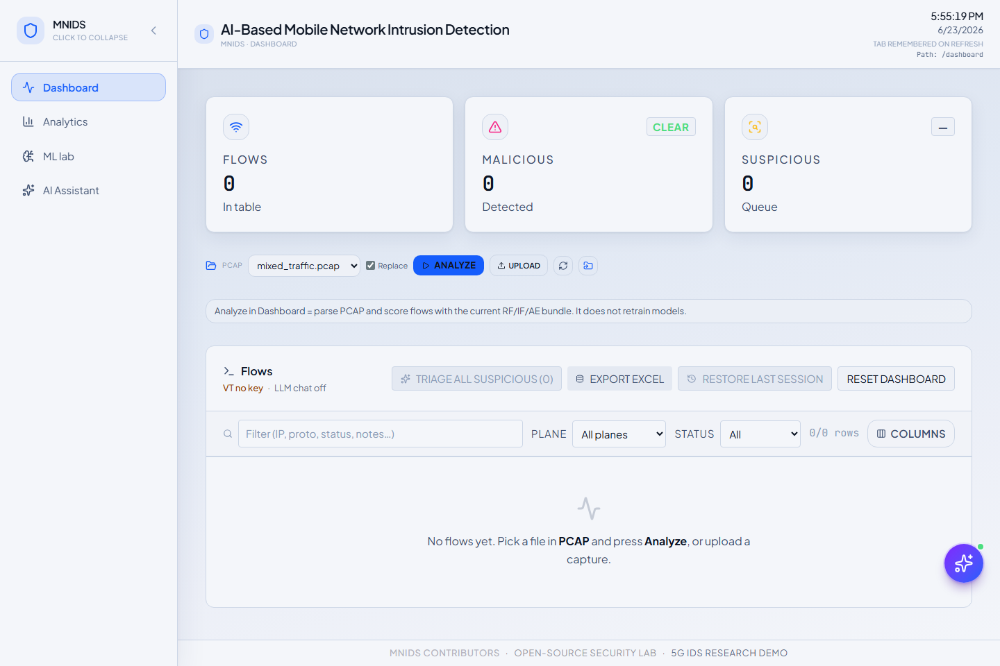
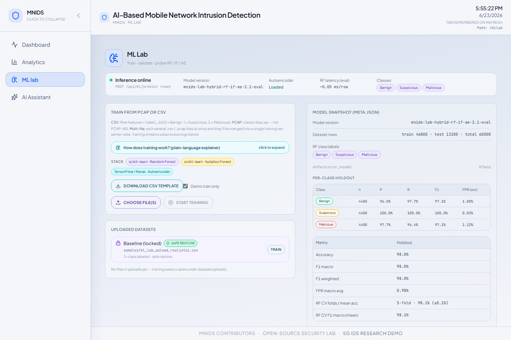
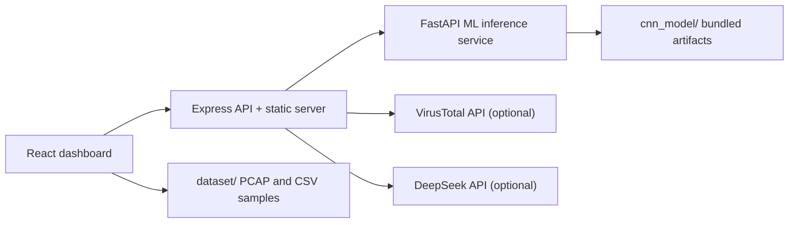

# 🛡️ AI-Based Mobile Network Intrusion Detection



AI-Based Mobile Network Intrusion Detection is a local **5G IDS research dashboard** for analyzing mobile-network-style traffic, PCAP-derived flows, and suspicious indicators. It ships with a usable web dashboard, backend APIs, sample traffic, and bundled machine-learning model artifacts so researchers can run it without training a model first.

## ✨ Highlights

- 🧠 **Bundled AI model**: Random Forest, Isolation Forest, and AutoEncoder artifacts are included in `cnn_model/`.
- 📡 **5G/mobile traffic workflow**: PCAP ingestion, flow parsing, traffic-plane hints, bearer/session fields, and analyst triage views.
- 🔎 **Threat enrichment**: optional VirusTotal IP/domain reputation checks.
- 💬 **AI assistant**: optional DeepSeek-powered dashboard assistant for explaining selected flows and export summaries.
- 📊 **Analyst dashboard**: live-style traffic table, analytics view, ML lab, export tools, and report-ready evidence.
- 🧪 **Sample data included**: datasets and PCAP samples are provided under `dataset/`.

## 📸 Screenshots

| Dashboard | ML Lab |
|---|---|
|  |  |

## 🧩 Architecture



## 🚀 Quick Start on Windows

1. Install **Node.js LTS** from <https://nodejs.org/>.
2. Install **Python 3.10+** from <https://www.python.org/> and enable **Add Python to PATH**.
3. Double-click `START.bat`.
4. When asked for keys:
   - Paste a DeepSeek API key to enable the AI assistant, or press Enter to skip.
   - Paste a VirusTotal API key to enable live reputation lookups, or press Enter to skip.
5. Open <http://127.0.0.1:5003> if the browser does not open automatically.

The dashboard still works if both optional keys are skipped.

## 🧰 Manual Run

```powershell
npm install
python -m venv .venv
.\.venv\Scripts\python.exe -m pip install -r backend\requirements.txt
npm run build
$env:PYTHON="$PWD\.venv\Scripts\python.exe"
node launch.mjs
```

## 🔐 Environment

Secrets belong in `backend/.env`, which is ignored by Git.

```env
DEEPSEEK_API_KEY=
VIRUSTOTAL_API_KEY=
VIRUSTOTAL_MIN_INTERVAL_MS=15000
MNIDS_PORT=5003
ML_SERVER_PORT=8787
ML_SERVER_URL=http://127.0.0.1:8787
NODE_ENV=production
DEBUG=false
```

Use `backend/.env.example` as the template. `START.bat` creates it automatically if missing.

## 🤖 Included Model Artifacts

The repo includes the current AI model bundle:

- `cnn_model/rf_pipeline.joblib`
- `cnn_model/iforest_pipeline.joblib`
- `cnn_model/ae_model.keras`
- `cnn_model/ae_scaler.joblib`
- `cnn_model/meta.json`
- evaluation plots and dashboard assets in `cnn_model/`

Model metadata currently reports holdout accuracy/F1 around **0.9804** on the bundled evaluation split. See `cnn_model/meta.json` and `cnn_model/metrics_dashboard.html` for details.

## 📂 Useful Paths

| Path | Purpose |
|---|---|
| `frontend/` | React dashboard source |
| `backend/server.js` | Express web/API server |
| `backend/inference_server.py` | FastAPI ML inference service |
| `cnn_model/` | Bundled trained model artifacts |
| `dataset/` | Training/demo CSV and PCAP samples |
| `docs/PROJECT_GUIDE.md` | Maintainer and repo guidance |
| `HOW_TO_RUN.md` | Beginner-friendly run guide |

## 🧪 Validation

```powershell
npm run build
.\.venv\Scripts\python.exe -m pytest
```

If no tests are present, at minimum run `npm run build` and start the app with `node launch.mjs` or `START.bat`.

## ⚠️ Scope

This is a local detection and analyst-support tool. It classifies and explains traffic; it does not block packets, change network policy, or act as an inline firewall.

## 📄 License

MIT License. See `LICENSE`.
