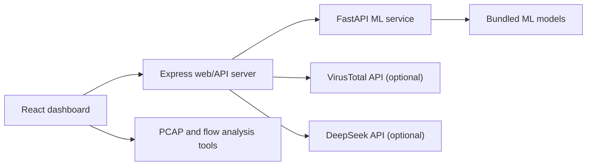

# Project Guide

## What This Repository Contains

AI-Based Mobile Network Intrusion Detection is a local 5G IDS research dashboard. It combines a React analyst UI, an Express API, and a FastAPI ML inference service.

The bundled model assets are kept in `cnn_model/`:

- `rf_pipeline.joblib` - Random Forest classifier pipeline
- `iforest_pipeline.joblib` - Isolation Forest anomaly detector
- `ae_model.keras` and `ae_scaler.joblib` - autoencoder model and scaler
- `meta.json` - feature schema and training metadata
- `*.png` and `metrics_dashboard.html` - model evaluation artifacts

Sample traffic and PCAP files are kept in `dataset/` so users can run the dashboard without collecting their own traffic first.

## Architecture

## Environment Behavior

The project works without external API keys. `START.bat` creates `backend/.env` from `backend/.env.example` when needed and asks for optional keys:

- DeepSeek key: enables the AI assistant.
- VirusTotal key: enables live IP/domain reputation lookups.

Press Enter at either prompt to skip it. Local ML detection, sample data, PCAP import, analytics, and exports still work.

## Public Repo Safety

Do not commit these:

- `backend/.env` or any real API key
- `.venv/`
- `node_modules/`
- `frontend/dist/`
- private reports or screenshots containing sensitive traffic

The `.gitignore` is set up for these defaults.
